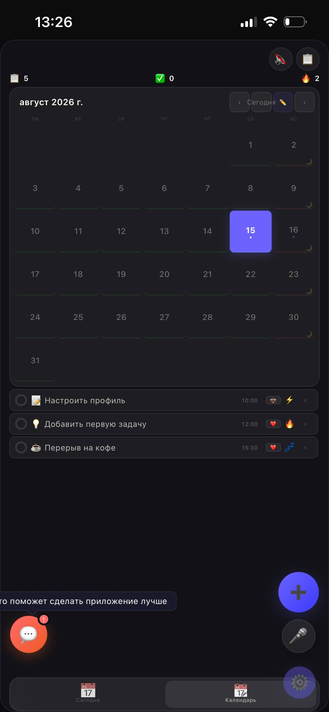
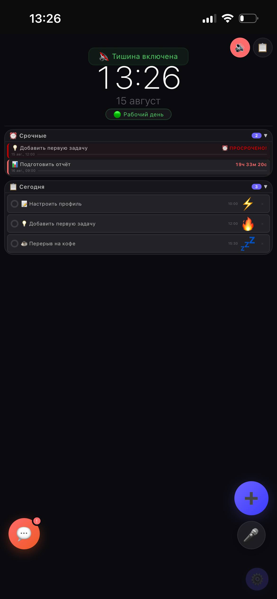

# archtime

Мой проект календаря-планера (PWA). 

Посмотреть демо: https://zvrvlg.github.io/archtime

## Технологии
- HTML5, CSS3, JavaScript
- Service Worker (`sw.js`) - кэширование 
- Manifest (`manifest.json`) - установка как приложения

## Статус
✅ Развёрнуто на GitHub Pages
-------
## Права и использование
Автор: zvrvlg
Код и дизайн - интеллектуальная собственность автора.
Использование и копирование без согласования запрещены.
© zvrvlg 2026
