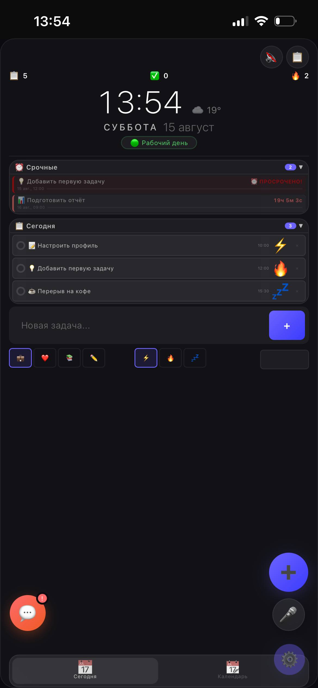
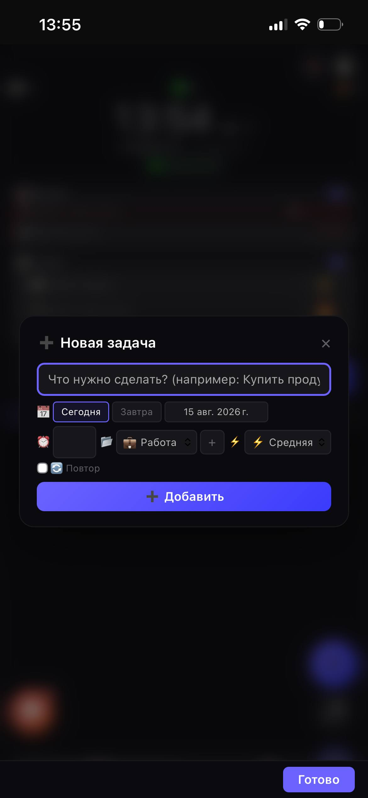
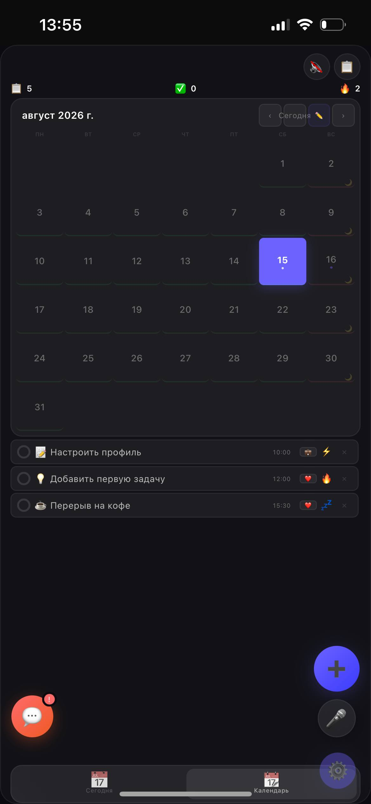
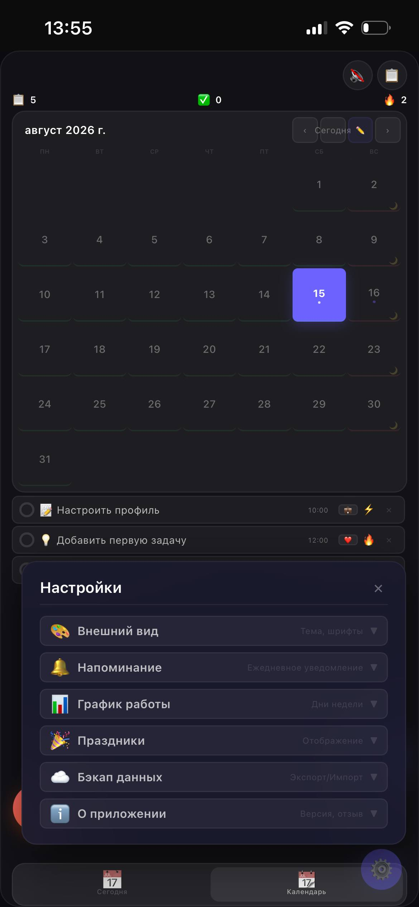

# Архитектор Времени - календарь-планировщик
*Проект находится в разработке. Мы не скрываем статус: если вы видите баг — это нормально для текущей версии. Помогите нам сделать его лучше!*
## Демо: https://zvrvlg.github.io/archtime/
## О проекте
Современный PWA-планировщик задач с календарем. 

## 🎯 Ключевые особенности PWA
* **Мгновенная установка** 
* **Оффлайн-доступ** - работает без интернета (пока в работе)
* **Push-уведомления** - напоминания даже при закрытом приложении
* **Адаптивность** - одинаково хорошо на всех устройствах

### 🔧 Функционал
* **Календарь** с ежедневным планированием
* **Система приоритетов** задач
* **Темы оформления** (светлая/тёмная/сезонные)
* **Напоминания** с настройками времени уведомлений

## 🛠️ Текущий статус

✅ **Реализовано:**
* Базовая структура PWA
* Основной функционал календаря
* Система создания задач
* Темы оформления
* Обратная связь
* Запись голосом задачи (например: Позвонить маме завтра в 10:00) - запись производится автоматически.

🚧 **В разработке:**
* Много идей, pwa дорабатывается, переделывается каждый день.

## 🔌 Установка и использование

### 📤 Установка PWA
1. Откройте сайт в браузере
2. Нажми "Добавить на экран домой"

### 🔔 Настройка уведомлений
* Включите push-уведомления
* Настройте время напоминаний
* Выберите тип уведомлений

## 🔍 Скриншоты

### Страница "Сегодня"

* **Текущая дата, и время, и погода(!)**
* **Статус рабочего дня (выделен цветом)** - опирается на настройку графика вашей работы (2\2, 5\2, 6\1 и тд)
**Быстрый доступ**:
Кнопка создания новой задачи (+)
Настройки
Голосовой ввод - в любой момент можно записать свою задачу, например "Написать письмо начальнику в понедельник в 9:00", задача автоматически добавится.

### Создание задачи

* **Форма создания**
Выбор даты (сегодня/завтра или произвольная)
Установка времени выполнения
Настройка приоритета (3 уровня)
Выбор категории задачи (4 варианта)
Возможность повторения (4 варианта периодичности)

### Календарь

* **Просмотр и управление**
Месяц с отметками событий
Цветовое выделение приоритетов
Быстрый переход к дате сегодня

### Настройки

* **Внешний вид**
Темы оформления (встроенные)
Размер шрифта
Фон (можно загрузить свой)
* **Уведомления**
Ежедневные напоминания (настраиваемые по времени)
* **Работа с данными**
!!Еще в доработке!!
**Информация о приложении**
Версия
Обратная связь
Сброс к стандартным настройкам
## 🤝 Вклад в проект, помощь
Обычный пользователь: Попробуйте использовать планировщик и напишите если что-то сломалось, или неудобно, или хотелось бы какую-то функцию добавить (можно обсудить).
Дизайнер: У нас есть темы, иконки pwa (icon-192.png, icon-512.png). Если у вас есть идеи по улучшению интерфейса — дайте ОС, рассмотрим любые предложения!

## Статус
✅ Развёрнуто на GitHub Pages
-------
## Права и использование
Автор: zvrvlg

Код и дизайн - интеллектуальная собственность автора.
Использование и копирование без согласования запрещены.
© zvrvlg 2026
